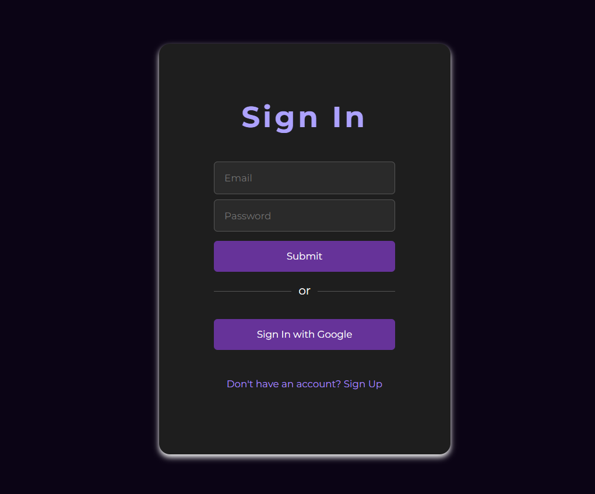
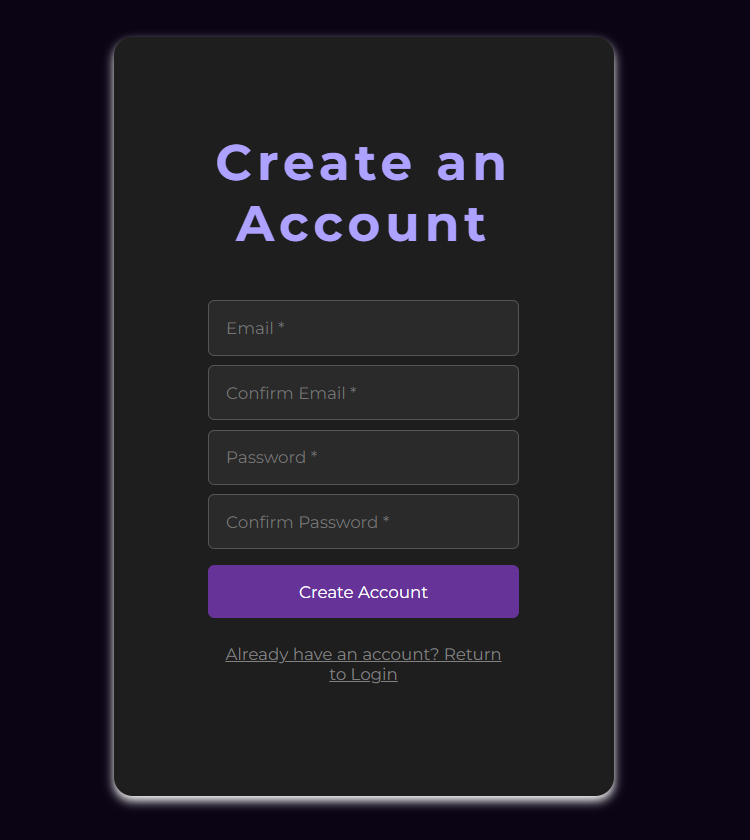

# Implement User Authentication (Issue #9)

This project demonstrates how to set up Firebase Authentication with email/password and Google sign-in using JavaScript. It includes user sign-in, sign-up, and session management, as well as storing user-specific data in Firestore.


## Dependencies

To run this project, you'll need to install Firebase:

```sh
npm install firebase
```

## Files Description

### `index.html`

This is the main HTML file for the project. It includes the structure of the login and sign-up forms.

### `main.css`

This CSS file contains styles for the login and sign-up forms, ensuring a responsive and visually appealing layout.

### `script.js`

This JavaScript file handles Firebase initialization, authentication (email/password and Google sign-in), user session management, and storing user-specific data in Firestore.

## Setup and Run

1. **Clone the repository:**

   ```sh
   git clone <repository-url>
   cd <repository-directory>
   ```

2. **Install dependencies:**

   ```sh
   npm install firebase
   ```

3. **Run the project:**

   You can use a tool like `live-server` to run a local server:

   ```sh
   npm install -g live-server
   live-server
   ```

   This will start a local server and open the project in your default web browser.

## Screenshots

### Sign In Page



### Sign Up Page



## Features

- Email/Password Sign In and Sign Up
- Google Sign In
- User session management
- Storing user-specific data in Firestore


### Author

Ayush Dey

